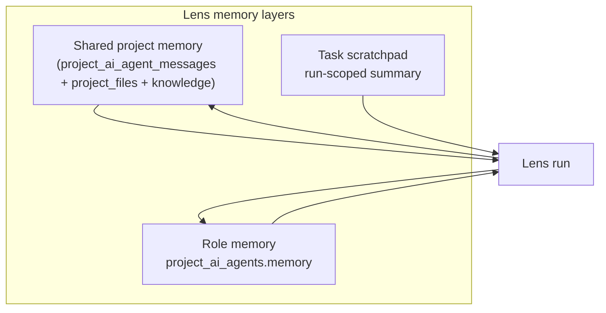
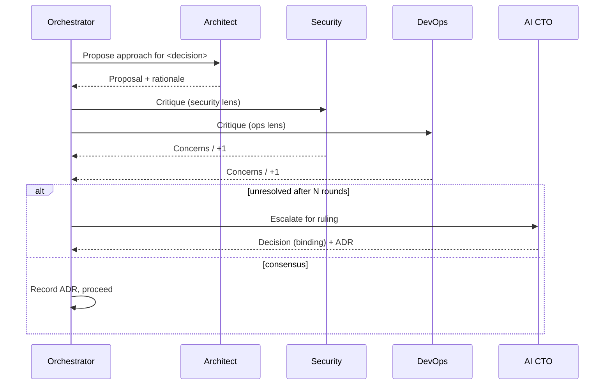
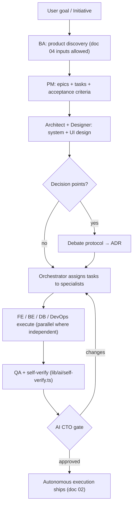

# 01 — Editor Intelligence Lenses

> **Goal.** When a user creates a project, Editor Intelligence maintains an
> internal roster of specialist lenses. Each lens has its own responsibilities,
> memory context, and communication channel. They collaborate and **debate before
> implementation**.

This is the conceptual core of Editor Intelligence. The runnable scaffold lives in
`lib/ai/editor-lenses/` (`types.ts`, `roles.ts`, `orchestrator.ts`).

## 1. The ten roles

Each lens is a typed definition (`AgentRole` in `lib/ai/editor-lenses/types.ts`) with a
system prompt, a model **tier** (reused from `MODEL_TIERS`), tools it may call,
and the artifacts it owns.

| Role | Model tier | Owns / produces | Can veto on |
|------|-----------|-----------------|-------------|
| **Product Manager** (`pm`) | `reasoning` | Initiative → epics → tasks, acceptance criteria, roadmap | scope creep |
| **Business Analyst** (`ba`) | `reasoning` | Market/competitor analysis, personas, user stories, business model | — |
| **Technical Architect** (`architect`) | `reasoning` | System design, service boundaries, tech choices (ADRs) | architecture |
| **UI Designer** (`designer`) | `design` | Design tokens, component specs, screen layouts | UX consistency |
| **Frontend Engineer** (`frontend`) | `coding` | React/TS components, routing, state | — |
| **Backend Engineer** (`backend`) | `coding` | API routes, business logic, integrations | — |
| **Database Engineer** (`database`) | `coding` | ERD, migrations, indexes, RLS | data integrity |
| **DevOps Engineer** (`devops`) | `coding` | CI/CD, IaC, deploy plan, env wiring | deployability |
| **QA Engineer** (`qa`) | `balanced` | Test plans, unit/integration/E2E tests, bug reports | release readiness |
| **Security Engineer** (`security`) | `reasoning` | Threat model, dependency/code scan, fixes | security |

The **AI CTO** (doc 03) is not a standing team member — it is a *review persona*
the orchestrator invokes at gates, able to override any role.

## 2. Per-lens memory & context

Each lens run reads/writes owner-scoped project context via the shipped
`project_ai_*` tables:

- **Shared project memory** — the codebase (`project_files`), the design knowledge
  base, and the public channel (`project_ai_agent_messages`). Mirrors how `lib/ai/agent.ts`
  already passes `knowledge` + `files` into a run.
- **Role memory** — durable notes a role keeps across tasks (e.g. the architect's
  ADR log). Stored in the `project_ai_agents.memory` JSONB field.
- **Task scratchpad** — ephemeral working notes for one task, summarized back into
  role/shared memory on completion to bound token growth.

Memory is **summarized, not accumulated**: each run appends a structured summary
rather than raw transcripts, keeping context within model windows (same
philosophy as the subagent finding summaries in `lib/ai/subagents.ts`).

## 3. Communication channels

Lenses talk over **`project_ai_agent_messages`** rows, surfaced live via Supabase Realtime
(reusing the realtime infra behind the collaboration panel). Channels:

- `channel='standup'` — broadcast status (PM aggregates).
- `channel='debate:<topic>'` — structured debate threads (see §4).
- `channel='review'` — QA/CTO review comments tied to files.
- `channel='handoff'` — explicit work handoffs (`from_role` → `to_role`).

This is the same pattern as the existing `messages` table but multi-author
(author is a role, not a user) and typed by channel.

## 4. The debate protocol (before implementation)

Contested decisions run a bounded debate before code is written. The orchestrator
detects a decision point (architect proposes a choice that the security or devops
or database role is allowed to veto) and opens a debate round.

Rules (enforced in `orchestrator.ts`):

- **Bounded** — max `DEBATE_MAX_ROUNDS` (default 2) to control cost/latency.
- **Veto-scoped** — a role can only block on its `vetoDomain` (table in §1).
- **Always recorded** — every resolved debate writes an ADR row
  (`project_ai_agent_decisions`), so decisions are auditable and reusable. This reuses the
  `engineering:architecture` ADR skill format.
- **Cost-aware** — debates are skipped for low-risk tasks (a CSS tweak doesn't
  convene a security review). Risk is scored from the task's touched paths +
  keywords, mirroring `shouldUseSubagents()`.

## 5. Control flow of one initiative

## 6. Integration points in the existing repo

| Editor intelligence piece | Reuses / extends |
|-------------|------------------|
| Agent run primitive | `lib/ai/agent.ts` (`AgentRunOptions`, tool loop) — each editor lens is an `agent.ts` run with a role system prompt + scoped tools |
| Model selection | `MODEL_TIERS` / `pickModel()` in `lib/ai/editor-intelligence.ts` |
| AI calls + billing | `generateAI(..., ctx)` in `lib/ai/generate.ts`; gateway logs `ai_cents` |
| Parallel exploration | `lib/ai/subagents.ts` (read-only investigations feed the architect) |
| Self-verification gate | `lib/ai/self-verify.ts` (the QA step) |
| Streaming to UI | existing SSE pattern in `app/api/ai/*` routes (`verify_status`, `wiring_status` events) → add `agent_status`, `debate_status` events |
| Persistence | new tables in migration 068 (doc 06) |

## 7. New API surface (full contract in doc 07)

- `POST /api/projects/[id]/editor-intelligence` — create/refresh the lens roster for a project.
- `POST /api/editor-intelligence/initiative` — submit a goal; streams the full run (SSE).
- `GET  /api/editor-intelligence/runs/[id]` — run status + lens transcript.
- `POST /api/editor-intelligence/debate/[id]/resolve` — human override of a debate/CTO ruling.

## 8. Phasing

- **P1 (foundation, in repo):** role definitions + orchestrator + sequential
  execution + persistence + SSE streaming.
- **P2:** parallel task execution + Realtime agent chatter UI (Editor Intelligence Console).
- **P3:** cross-initiative role memory, learned debate shortcuts, cost budgets.
