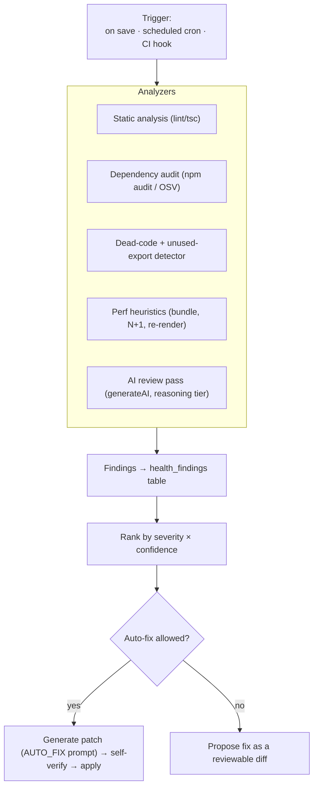
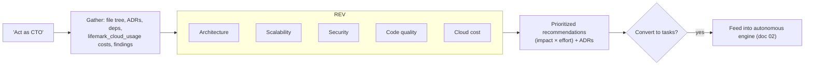
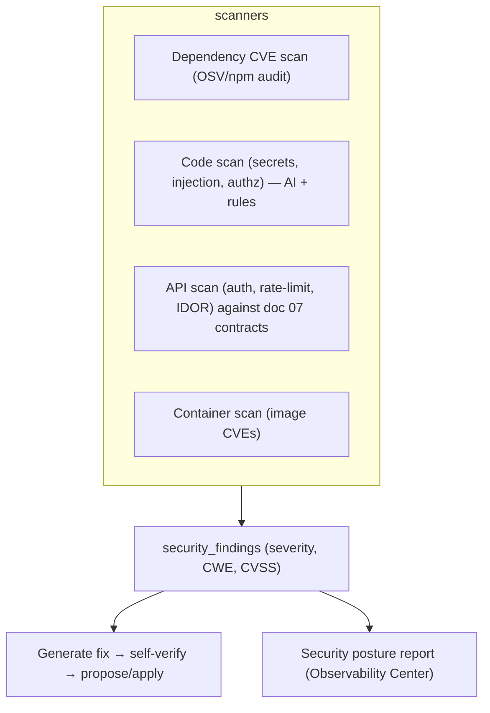

# 03 — Self-Healing · AI CTO · Testing Lab · Security Center

> Cluster goal: the codebase continuously improves itself, a CTO persona reviews
> the big picture, and autonomous labs generate and run tests and security scans.

This cluster extends the existing **self-verification loop**
(`lib/ai/self-verify.ts`) from "fix the build I just made" into a standing,
scheduled capability.

## 1. Self-healing codebase

Continuously detect **bugs, vulnerabilities, performance issues, dead code, and
dependency issues**, then propose fixes (auto-apply optional, behind approval).

- **Reuses** the headless-Chromium verify path and `AUTO_FIX_SYSTEM_PROMPT`
  already in `lib/ai/self-verify.ts`; adds scheduled invocation
  (the `schedule` skill / `vercel.json` cron, like `/api/cloud/daily-backups`).
- **Findings** persist in `health_findings` (doc 06) with status
  `open → proposed → fixed → dismissed`.
- **Auto-fix after approval** is gated by a per-project `self_heal` permission
  (same JSON pattern as `cloud_tool_permissions`).

## 2. AI CTO Mode

User says **"Act as CTO"** → a review persona evaluates architecture,
scalability, security, code quality, and cloud costs and returns prioritized,
actionable improvements. It is also the **binding tie-breaker** for agent debates
(doc 01 §4).

- **Cost lens** reads real spend from `lifemark_cloud_usage` (`ai_cents` +
  instance cost) — the data the gateway already records.
- Output is an `agent_decisions`/recommendation set that can be one-click
  converted into an initiative.

## 3. Autonomous Testing Lab

Generate and continuously run **unit, integration, E2E, load, and security**
tests.

| Test type | Generator | Runner |
|-----------|-----------|--------|
| Unit | QA agent from acceptance criteria | Vitest (repo already uses `*.test.ts`) |
| Integration | QA agent from API contracts (doc 07) | Vitest + test DB |
| E2E | QA agent from user stories | Playwright (`PLAYWRIGHT_ENABLED`, already wired) |
| Load | DevOps agent from SLOs | k6 script in sandbox |
| Security | Security agent | see §4 |

Runs execute in the **sandbox** (doc 05) and stream results to the Observability
Center; failures open `health_findings` and can trigger the self-healing loop.
Aligns with the `engineering:testing-strategy` skill.

## 4. Autonomous Security Center

Continuously scan **dependencies, source code, APIs, and containers**; generate
fixes automatically (approval-gated).

- Reuses the threat-model framing of the `engineering:security-review` /
  `security-review` skills.
- **Never** auto-applies a security fix on the **Live** environment without
  approval (migration 046 lock).
- Secrets handling stays server-side (mirrors the connector gateway: credentials
  in `.env.local`, never exposed to the model).

## 5. Shared data model

All four features write into two tables (doc 06): `health_findings` (bugs, perf,
dead-code, deps) and `security_findings` (CVE/CWE), both owner-scoped with RLS,
both linking to `project_files` and optional `project_ai_initiatives` checkpoint tasks for the fix.

## 6. Phasing

- **P1:** AI CTO review (read-only recommendations) + extend self-verify into a
  scheduled self-heal scan writing `health_findings`.
- **P2:** Testing Lab (unit/integration/E2E) in the sandbox; Security Center deps+code scans.
- **P3:** load tests, container scans, auto-fix with approval workflow + posture dashboards.
