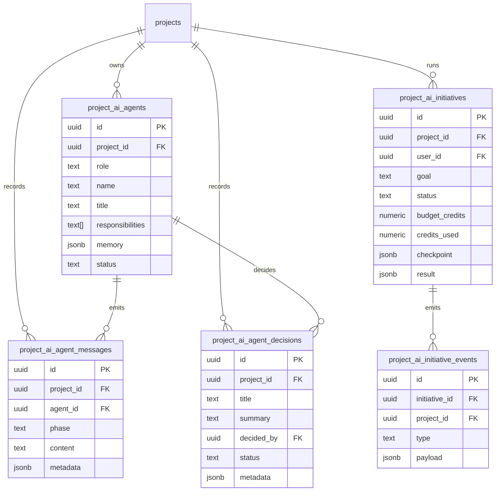

# 06 - Editor Intelligence Database Schema

> Runnable SQL: [`supabase/migrations/068_editor_intelligence_lenses.sql`](../../supabase/migrations/068_editor_intelligence_lenses.sql).
> The shipped foundation is intentionally small and lives inside LifemarkAI's
> existing project model. It is not a separate product/module schema.

## 1. ERD

## 2. Table reference

| Table | Key columns | Purpose |
|-------|-------------|---------|
| `project_ai_agents` | `project_id`, `role`, `name`, `title`, `responsibilities`, `memory`, `status` | One internal editor lens per role, scoped to a LifemarkAI project. |
| `project_ai_agent_messages` | `project_id`, `agent_id`, `phase`, `content`, `metadata` | Lens discussion/status stream for the Editor Intelligence panel. |
| `project_ai_agent_decisions` | `project_id`, `title`, `summary`, `decided_by`, `status`, `metadata` | Persisted architecture/product decisions from the internal lenses. |
| `project_ai_initiatives` | `project_id`, `user_id`, `goal`, `status`, `checkpoint`, `credits_used`, `result` | Durable editor-intelligence run state for resume/replay. |
| `project_ai_initiative_events` | `initiative_id`, `project_id`, `type`, `payload` | Append-only event stream for rebuilding run UI after refresh/disconnect. |

## 3. RLS and ownership

- Every table is owner-scoped through `projects.user_id`.
- Public reads follow `projects.is_public`.
- Collaborators with accepted membership can read.
- Owners and accepted editors can write.
- Foreign keys cascade when the parent project is deleted.

## 4. Indexes and trigger

- `project_ai_agents(project_id, role)` supports one roster row per role.
- `project_ai_agent_messages(project_id, created_at desc)` supports recent discussion fetches.
- `project_ai_agent_decisions(project_id, created_at desc)` supports decision history.
- `project_ai_initiatives(project_id, status, updated_at desc)` supports active/resumable run lookup.
- `project_ai_initiative_events(initiative_id, created_at asc)` supports replaying a run in order.
- `update_project_ai_agents_updated_at()` keeps `project_ai_agents.updated_at` current.

## 5. Future extensions

Autonomous task DAGs, health findings, security findings, marketplace tables,
organizations, and model-training tables are roadmap items in docs 02, 03, and
05. They should be added as separate migrations only when the corresponding
features are implemented and wired into the app.
