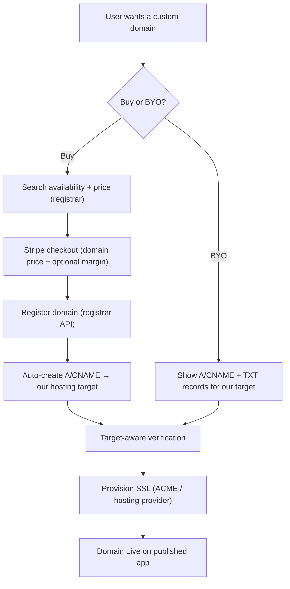
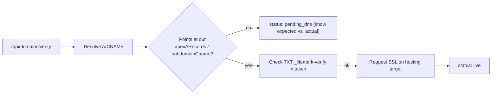

# 09 — Domains & Hosting (Lovable-parity)

> Goal: match Lovable's structure where the platform is **both the host and an
> in-product domain reseller** — buy a domain, pay, auto-register, auto-wire DNS,
> verify against our own target, and provision SSL. Today LifemarkAI is a
> bring-your-own-domain wrapper over Netlify with naive verification and no
> purchase flow (see `app/api/domains/route.ts`, `domains/verify/route.ts`).

## 1. Gap vs. Lovable (what this doc closes)

| Capability | Lovable | LifemarkAI today | Target |
|------------|---------|------------------|--------|
| Hosting edge | Own managed edge + stable IPs, `*.lovable.app` | Netlify alias (token) or `*.lifemarkai.app` fallback | Own/abstracted hosting target with stable apex IPs + wildcard subdomain |
| Buy domain in-product | ✅ via IONOS registrar | ❌ none | Registrar abstraction (Cloudflare default, IONOS optional) |
| Pay for domain | ✅ at registrar price | ❌ | Stripe charge → register |
| DNS auto-config | ✅ automatic or manual | manual records only | automatic (when bought through us) + manual (BYO) |
| Verification | verifies + provisions SSL | `dns.lookup()` resolves to *anything* | **target-aware** check + SSL provisioning |
| SSL | Let's Encrypt on their edge | relies on Netlify | own ACME provisioning on hosting target |

## 2. Two paths: Buy vs. Bring-your-own



## 3. Hosting target abstraction

The custom-domain flow must point at a **stable hosting target** we control.
Define a `HostingTarget` so the domain layer is independent of where apps run:

```ts
interface HostingTarget {
  // Records a custom domain must point at to reach the published app.
  apexARecords: string[];      // e.g. ["75.2.60.5", "99.83.190.102"] (Netlify) or our LB IPs
  subdomainCname: string;      // e.g. "lifemark-{id}.lifemarkai.app"
  // Attach/detach a hostname on the hosting edge (alias/route + SSL request).
  attachHostname(projectId: string, domain: string): Promise<void>;
  detachHostname(projectId: string, domain: string): Promise<void>;
}
```

Drivers: `NetlifyHostingTarget` (today's behavior, extracted), and a future
`PlatformHostingTarget` (our own edge / Cloudflare for SaaS) for Lovable-level
control. This removes the silent `*.lifemarkai.app` fallback that points nowhere.

## 4. Registrar abstraction

`lib/domains/registrar.ts` (scaffolded). One interface, swappable drivers:

```ts
interface DomainRegistrar {
  id: "cloudflare" | "ionos";
  search(query: string): Promise<DomainSuggestion[]>;       // availability + price
  register(domain: string, contact: RegistrantContact, years: number): Promise<RegisterResult>;
  configureDns(domain: string, records: DnsRecord[]): Promise<void>;
  renew?(domain: string, years: number): Promise<void>;
}
```

- **Default: Cloudflare Registrar** — at-cost pricing (no markup by the registrar),
  clean API, and pairs with Cloudflare DNS for instant record writes.
- **Optional: IONOS** — what Lovable uses; add for parity / pricing choice.
- Credentials live server-side (env / per-platform secret), never sent to the
  client — same discipline as the connector gateway.

## 5. Pricing & payment

- `search()` returns the **registrar price**; the platform may add a transparent
  margin (config, default 0). Mirror Lovable's "no per-domain markup" by default.
- Charge via **Stripe Checkout** (one-time for year-1, then renewal subscription
  or annual charge). On `checkout.session.completed` with
  `metadata.kind === "domain_purchase"`, the webhook calls `register()` then
  `configureDns()` and records the order (migration 069).
- Reuses the existing Stripe webhook router pattern (parallels `app_subscription`
  and the planned `marketplace` branch in doc 05).

## 6. Target-aware verification (fixing the naive check)

Today's verify only checks the domain resolves to *something*. Replace with a
check that the domain actually points at **our** target, plus a TXT
ownership token:



- Store a per-domain `verify_token` (TXT `_lifemark-verify.<domain>`).
- Compare resolved records against `HostingTarget` values — not just "resolves".
- Only flip `custom_domain_verified = true` when it points at us **and** the TXT
  matches, then call `attachHostname()` to trigger SSL.

## 7. SSL

- **Netlify target:** Netlify provisions Let's Encrypt automatically once the
  alias + DNS are correct (today's behavior — keep).
- **Platform target:** own ACME (Let's Encrypt) via the edge provider
  (e.g. Cloudflare for SaaS custom hostnames, or Caddy/Traefik on our LB).
- Document the **Cloudflare-proxy caveat** in the UI (grey-cloud / DNS-only),
  the #1 support issue on Lovable.

## 8. Data model (migration 069)

`domain_registrations` (owner-scoped, RLS): `project_id`, `domain`, `registrar`,
`status` (`searching|pending_payment|registered|dns_pending|live|failed|expired`),
`price_cents`, `years`, `auto_renew`, `stripe_ref`, `expires_at`, `verify_token`.
See doc 06 conventions; SQL in `supabase/migrations/069_domain_registrations.sql`.

## 9. API surface

| Method | Path | Purpose |
|--------|------|---------|
| GET | `/api/domains/search?q=` | availability + price (registrar) |
| POST | `/api/domains/buy` | start Stripe checkout for a domain |
| POST | `/api/domains` | attach a BYO domain (existing, hardened) |
| POST | `/api/domains/verify` | target-aware verify + SSL trigger (existing, rewritten) |
| DELETE | `/api/domains` | detach (existing) |
| webhook | Stripe `checkout.session.completed` | register + configure DNS on paid purchase |

## 10. Phasing

- **P1:** extract `HostingTarget` (Netlify driver) + rewrite verification to be
  target-aware with TXT token. No new vendor needed; closes the correctness gap.
- **P2:** registrar abstraction + Cloudflare driver + `/search` + `/buy` + Stripe
  purchase webhook + migration 069. Closes the in-product purchase gap.
- **P3:** `PlatformHostingTarget` (own edge, Cloudflare for SaaS) + own ACME +
  IONOS driver. Closes the hosting-ownership gap → full Lovable parity.
