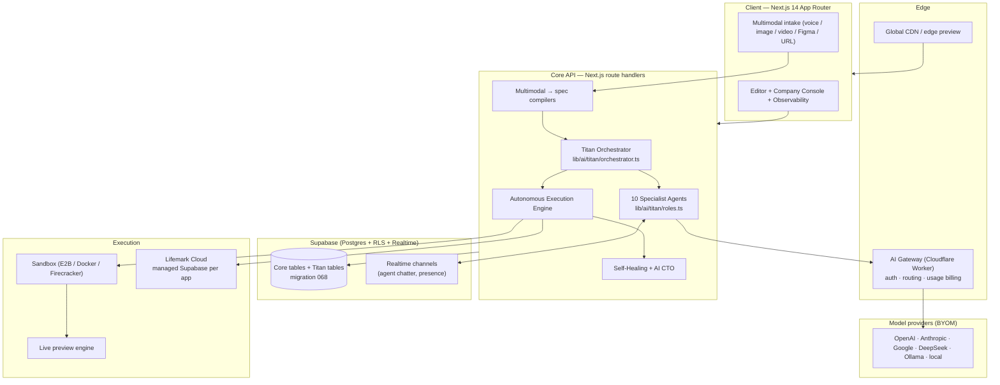
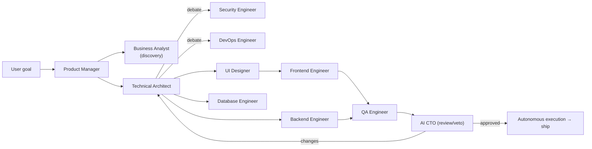

# Project Titan AI v2.0 — Master Architecture Blueprint

> Evolution of **LifemarkAI** (a Lovable.dev clone) into an **AI-native operating
> system for software creation** — a platform that behaves like a complete
> software company, not just a code generator.
>
> This document set is the design source of truth. It extends the existing
> codebase (`Next.js 14` + `Supabase` + multi-model AI gateway) described in
> `/CLAUDE.md` rather than replacing it.

## 1. What changes vs. today

| Dimension | LifemarkAI today | Titan v2.0 |
|-----------|------------------|------------|
| Generation unit | One AI flow (chat / plan / build / agent) | A **virtual software company** of 10 specialist agents that collaborate and debate |
| Autonomy | Step-by-step prompting | **Autonomous execution engine** — one goal → roadmap → full app |
| Quality | Self-verify loop (`lib/ai/self-verify.ts`) | **Self-healing codebase** + AI CTO review + autonomous testing/security labs |
| Input | Text prompt | **Multimodal**: voice, screenshot, Figma, video, URL reverse-engineering |
| Output | One app | Apps **plus** product strategy, marketing, infra, CI/CD, observability |
| Business | Single SaaS | **Marketplace, app store, white-label, BYOM, model training** |

The four delivery clusters (each has its own design doc):

1. **AI Software Company + Autonomous Execution** → [`01-ai-software-company.md`](01-ai-software-company.md), [`02-autonomous-execution.md`](02-autonomous-execution.md)
2. **Self-Healing + AI CTO + Testing/Security** → [`03-self-healing-cto-testing-security.md`](03-self-healing-cto-testing-security.md)
3. **Multimodal Input** → [`04-multimodal-input.md`](04-multimodal-input.md)
4. **Platform / Business Layer** → [`05-platform-business-layer.md`](05-platform-business-layer.md)

Supporting specs: [`06-database-schema.md`](06-database-schema.md) · [`07-service-contracts-api.md`](07-service-contracts-api.md) · [`08-roadmap.md`](08-roadmap.md) · [`09-domains-hosting.md`](09-domains-hosting.md)

## 2. Design principles (carried over from the existing codebase)

These are non-negotiable because the platform already depends on them:

- **Every AI call goes through `generateAI()`** (`lib/ai/generate.ts`) so the
  Cloudflare gateway can attribute usage and bill `ai_cents`. Titan agents call
  the *same* function with `ctx: { projectId, userId, agentRunId }`.
- **Per-task model tiers** (`MODEL_TIERS` in `lib/ai/editor-intelligence.ts`)
  already pick the best model per task. Titan maps each **agent role** to a tier
  (architect → `reasoning`, frontend → `coding`, designer → `design`, etc.).
- **Credits are fractional** (`computeCreditCost()`); a multi-agent run is just a
  sum of per-step costs — no new billing primitive needed.
- **Test/Live environment lock** (migration 046, `423 environment_locked`) must
  be enforced by every new code-writing path, including autonomous runs.
- **RLS-first**: every new table is owner-scoped exactly like `projects`.
- **Supabase client discipline**: server / client / admin clients are not
  interchangeable (see `/CLAUDE.md`).

## 3. System architecture (high level)

## 4. The "software company" mental model

A **Project** in Titan is a **company** with a **roadmap**, a **team of agents**,
and a **shared workspace** (the codebase + a knowledge base). A user request
("Build Uber") becomes an **Initiative** that the Product Manager agent breaks
into **Epics → Tasks**, which the orchestrator assigns to the right specialists.
Agents **debate** contested decisions in a structured round before any code is
written, and the AI CTO can **veto** on architecture, security, or cost grounds.

## 5. How to read the rest

Each subsystem doc follows the same shape: **purpose → data model → service
contract → control flow (mermaid) → integration points in the existing repo →
phasing**. Code scaffolding for the orchestrator core lives in
`lib/ai/titan/` and is referenced from doc 01.

## 6. Honest scope note

This blueprint is buildable in phases (see [`08-roadmap.md`](08-roadmap.md)). The
repo ships the **foundational, runnable layer**: the orchestrator + 10 role
definitions (`lib/ai/titan/`), the database schema (`migration 068`), and the
service contracts. The remaining subsystems (video→app, model training center,
multi-region edge at 100M-user scale) are specified here as engineering-ready
designs, not yet fully implemented — they depend on infrastructure decisions
captured in doc 05 and the roadmap.
