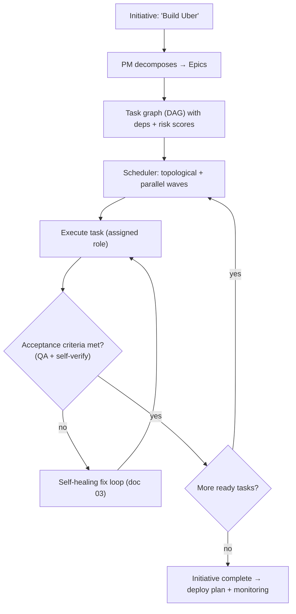
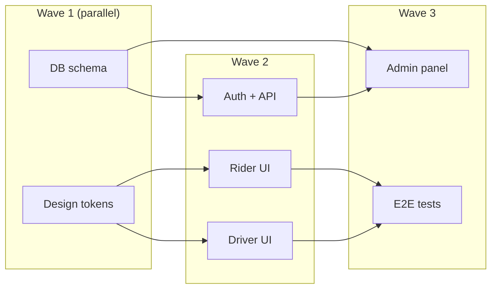

# 02 — Autonomous Execution Engine

> **Goal.** "Build Uber" → roadmap, database, frontend, backend, mobile app,
> admin panel, deployment plan, monitoring — without step-by-step prompting.

## 1. From goal to shipped system

The engine turns one **Initiative** into a dependency graph of **tasks** and
drives the company (doc 01) to execute it to completion, pausing only at
human-approval gates the user configured.

## 2. Task graph & scheduler

- **Decomposition** — PM agent emits epics; each epic yields tasks with
  `depends_on` edges, an owning role, an effort estimate, and a risk score.
- **Scheduling** — tasks form a DAG; the scheduler runs **waves** of independent
  tasks in parallel (bounded by `MAX_PARALLEL_TASKS`, default 3 to control spend),
  respecting `depends_on`.
- **Resumability** — graph + per-task status persist in `agent_tasks`
  (doc 06), so a run survives the 300s `maxDuration` window by re-entering and
  continuing from the first non-`done` wave (same pattern as the existing
  `job_queue` table).

## 3. Generated deliverables per initiative

For a full-app initiative the engine produces, each as tracked artifacts:

- **Roadmap** — epics/tasks (`agent_tasks`, surfaced in the AI Project Manager, doc 05).
- **Database** — migrations applied via the existing managed-backend path
  (`lib/cloud/auto-wire.ts` + `runManagedSql`).
- **Frontend** — React/TS app files (existing `project_files`).
- **Backend** — API routes + the connector gateway wiring (`connector-proxy`).
- **Mobile app** — React Native target (existing `buildReactNativePrompt`) /
  Capacitor (`capacitor.config.ts` already in repo).
- **Admin panel** — generated as a second surface in the same project.
- **Deployment plan** — DevOps agent emits `vercel.json` / IaC (doc 05 Cloud Architect).
- **Monitoring** — observability config wired to the Observability Center (doc 05).

## 4. Human-in-the-loop gates

Autonomy is configurable per project via `cloud_tool_permissions`-style settings
(extend the existing `cloud_tool_permissions` JSON, migration 061):

| Gate | Default | Behavior |
|------|---------|----------|
| `database` | `ask` | migrations generated, applied only on approval |
| `deploy` | `ask` | deploy plan generated, executed on approval |
| `spend` | `budget` | run pauses when the initiative's credit/`ai_cents` budget is hit |
| `live_env` | `block` | code-writing returns `423 environment_locked` on Live (migration 046) |

## 5. Safety & cost controls

- **Budget guardrail** — each initiative carries a max-credit budget; the
  orchestrator checks remaining balance via `claimDailyCredits()` + `deduct_credits`
  before each wave and pauses (not fails) when exhausted.
- **Loop bound** — `MAX_WAVES` and per-task `maxIterations` (from `agent.ts`)
  prevent runaway loops.
- **Idempotent tasks** — re-running a `done` task is a no-op; file writes are
  content-addressed against `project_files`.

## 6. API surface

- `POST /api/titan/initiative` — start (streams waves + per-task status as SSE).
- `POST /api/titan/initiative/[id]/pause` · `/resume` · `/approve-gate`.
- `GET  /api/titan/initiative/[id]/graph` — live task DAG for the UI.

## 7. Phasing

- **P1:** sequential execution of the task graph + gates + persistence.
- **P2:** parallel waves + resumability across `maxDuration` boundaries.
- **P3:** budget-aware scheduling, learned effort estimates, mobile/admin targets.
