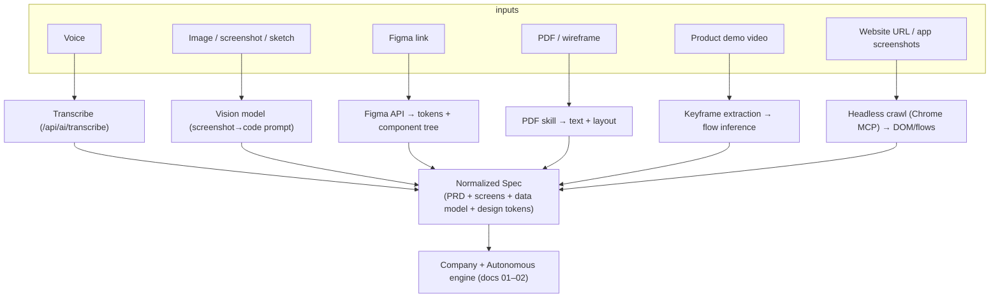
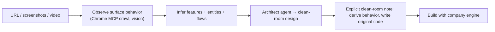

# 04 — Multimodal App Creation

> Cluster goal: accept voice, images, screenshots, wireframes, PDFs, Figma links,
> hand-drawn sketches, product demo videos, and URLs — and generate applications
> directly from them.

Every modality compiles to one normalized artifact — a **Spec** (PRD + screen
list + data model hints) — which then feeds the same company/autonomous engine
(docs 01–02). This keeps one code path downstream.



## 1. Voice → Application

- Reuses the existing **`/api/ai/transcribe`** route for ASR.
- Transcript → BA/PM agents produce a **PRD**, then the normal flow builds UI,
  database, backend, mobile. "Real-time" = stream partial transcript → stream
  spec → stream build (existing SSE).

## 2. Screenshot → App (pixel-perfect)

- Already partly present: **`SCREENSHOT_TO_CODE_SYSTEM_PROMPT`** in
  `lib/ai/system-prompts.ts`. Titan extends it to detect layout, components,
  spacing, and fonts and emit design tokens before code, improving fidelity.
- Output feeds the Designer agent (tokens) + Frontend agent (components).

## 3. Figma (supercharged)

- Import a full Figma project via the Figma REST API (token stored like a
  connector credential in `.env.local`).
- Extract **design tokens** (color/spacing/type), generate components, and
  responsive layouts; maintain consistency by writing tokens into the Designer
  agent's role memory so all subsequent screens reuse them.

## 4. PDF / wireframe

- Uses the repo's **`pdf` skill** to extract text + table/layout structure, then
  the vision path for visual wireframes. Produces screen + data-model hints.

## 5. Video → Application

- Extract keyframes, cluster into distinct **screens**, infer **navigation flows**
  from transitions, and reconstruct features. Heavier; **P3** in the roadmap.
- Pipeline: ffmpeg keyframes (sandbox) → vision captioning per frame → flow graph
  → Spec.

## 6. Reverse-Engineering Engine

Input a **website URL**, **mobile-app screenshots**, or a **product video**;
output **architecture, feature list, database design, and a source-code
structure** — **without copying proprietary code**.



**Guardrail (important).** The engine reconstructs *observable behavior and
structure* and writes **original** code; it does not scrape, decompile, or
reproduce proprietary source, and it records a clean-room provenance note on the
generated project. Trademarked names/assets are flagged, not copied.

## 7. Shared Spec format

The normalized `Spec` is stored on `agent_initiatives.spec` (JSONB, doc 06):

```jsonc
{
  "source": "voice|screenshot|figma|pdf|video|url|text",
  "prd": { "summary": "...", "goals": [], "personas": [], "userStories": [] },
  "screens": [{ "name": "...", "components": [], "notes": "..." }],
  "dataModel": [{ "entity": "...", "fields": [] }],
  "designTokens": { "colors": {}, "spacing": {}, "typography": {} },
  "provenance": { "cleanRoom": true, "sources": [] }
}
```

## 8. Integration points

| Modality | Reuses |
|----------|--------|
| Voice | `/api/ai/transcribe` |
| Screenshot/sketch | `SCREENSHOT_TO_CODE_SYSTEM_PROMPT`, vision via `generateAI` |
| PDF | `pdf` skill |
| URL/app crawl | Claude-in-Chrome MCP tools |
| Image storage | existing project storage / Cloud buckets |

## 9. Phasing

- **P1:** voice, screenshot, PDF → Spec → build (all reuse existing pieces).
- **P2:** Figma import + reverse-engineering from URL.
- **P3:** video → app, mobile-app-screenshot reverse engineering.
