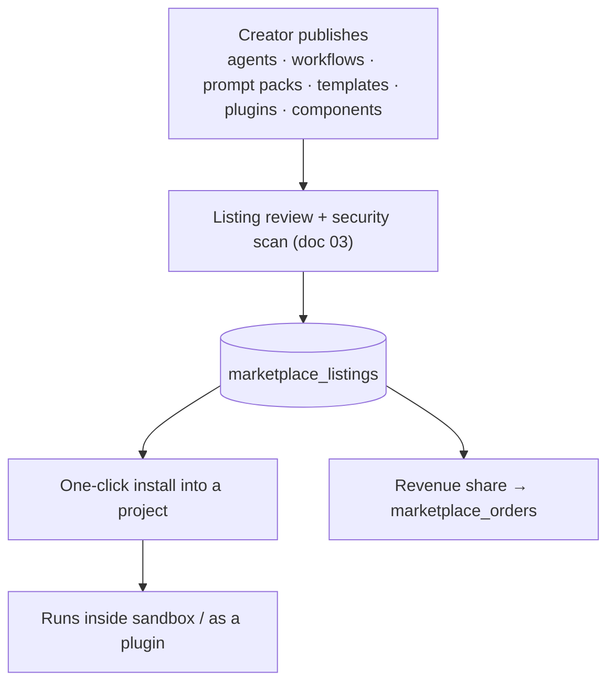
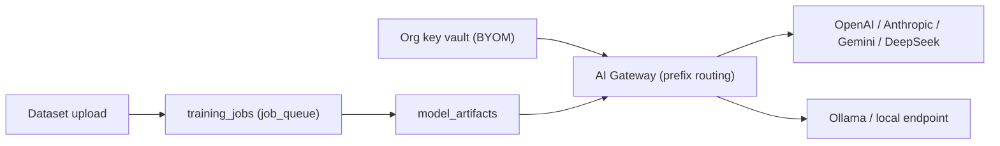

# 05 — Platform & Business Layer

> Cluster goal: turn Titan from a tool into a platform — marketplace, app store,
> monetization, white-label, BYOM/model training, cloud architect, observability,
> and the execution/preview substrate — plus the business-intelligence surfaces
> (AI Project Manager, AI Business Analytics).

## 1. Startup Builder & Product Discovery surfaces

Before/around coding, the BA + PM agents (doc 01) generate business artifacts and
store them as project documents (`project_files` under `docs/`):

- **Product Discovery** — market analysis, competitor analysis, feature matrix,
  personas, user stories, business model.
- **Startup Builder** ("Build SaaS for gyms") — product strategy, pricing,
  subscription plans, landing pages, marketing copy, analytics + CRM setup.

These reuse the `content` and `reasoning` model tiers and the connector gateway
for CRM/analytics wiring. No new infra — they are agent outputs.

## 2. Marketplace & AI App Store

- **Two storefronts, one catalog**: a creator **Marketplace** (agents,
  workflows, prompt packs, templates) and an **AI App Store** (plugins, agents,
  components — Shopify/VS-Code-Marketplace style).
- **Plugins** reuse the existing plugin format already supported by the platform
  (CLAUDE/Cowork plugins: MCPs + skills + tools).
- **Revenue sharing** via Stripe Connect; orders + payouts in `marketplace_orders`
  (doc 06). Reuses the existing Stripe webhook router with a new
  `metadata.kind === "marketplace"` branch (parallels `app_subscription`).

## 3. Monetization

| Model | Mechanism |
|-------|-----------|
| Subscription billing | existing Stripe subscriptions + `apply_plan_renewal` |
| Usage billing | existing `lifemark_cloud_usage` + `bill_cloud_usage` (AI + instance) |
| Credit billing | existing fractional credits (migration 063) |
| Marketplace commissions | Stripe Connect + `marketplace_orders` (new) |
| Enterprise contracts | org-level plans + invoicing (new `org_contracts`) |

The first three already exist — Titan adds only commissions + enterprise.

## 4. White-Label Platform

Organizations run their own branded Titan: their branding, domain, and AI models.

- **Branding/domain** — per-org theme + custom domain (extend `feature_flags` +
  a new `organizations` table with `brand` JSONB and `custom_domain`).
- **Own AI models** — points the org at its own provider keys / gateway via BYOM (§5).
- Tenant isolation is **RLS by `org_id`**, the same model already used for users.

## 5. BYOM, Private LLMs & Model Training Center

- **BYOM / Private LLM** — support OpenAI, Anthropic, Gemini, DeepSeek, Ollama,
  and local LLMs. The **AI Gateway already routes by model prefix**; BYOM adds an
  org-scoped key vault and an `ollama`/`local` prefix that routes to a
  self-hosted endpoint instead of a public provider.
- **Model Training Center** — enterprises fine-tune models and upload datasets to
  create private agents. Stored in `model_artifacts` + `training_jobs` (doc 06);
  training runs are long-lived `job_queue` jobs executed off the request path.
  Fine-tuned models register as new entries the gateway can route to.

## 6. AI Cloud Architect & Deployment

Deploy to **AWS, Azure, GCP, DigitalOcean**; auto-generate **Terraform, Helm,
Kubernetes, and CI/CD**.

- The DevOps agent emits IaC as project files; an executor (sandbox, doc 7) runs
  `terraform plan`/`apply` against the user's connected cloud creds (stored like
  connector credentials, never exposed to the model).
- Extends the existing deploy path (`/api/deploy`, `vercel.json`) and Lifemark
  Cloud managed-backend provisioning.

## 7. Execution Substrate

- **Sandbox Execution System** — each project gets isolated execution via
  **E2B / Docker / Firecracker**, abstracted behind the `SandboxProvider`
  interface in **`lib/sandbox/index.ts`** (E2B driver shipped; Docker/Firecracker
  later for stronger isolation). The provider creates a sandbox, writes the
  generated files, installs deps, starts the dev server, and returns a **live
  public preview URL** via `getHost(port)` — real server-side execution, not just
  a client-side render. The E2B SDK is dependency-optional (guarded dynamic
  import); without `E2B_API_KEY` the provider is disabled and callers fall back
  to the in-browser preview. Pattern adapted from the Lovable-Clone reference.
- **Live Preview Engine** — instant changes for web, mobile, and APIs. Keeps the
  existing two engines (srcdoc fallback + WebContainer bridge,
  `lib/preview/veb-bridge.ts`) for fast client preview, and uses the sandbox
  provider for a real running preview (server code, real dev server, true URL).

### 7a. Durable / resumable agent runs

The Lovable-Clone reference runs its agent as an **Inngest background job** where
every phase (`get-sandbox`, `run-agent`, `save-result`) is a checkpointed,
retryable `step.run(...)`, so the run is not bound by an HTTP request's lifetime.
LifemarkAI's agent/build routes are bound by `maxDuration = 300`. To match the
autonomous-execution resumability target (doc 02 §2), move long agent/initiative
runs onto a **durable step runner** (Inngest, or the existing `job_queue` table
as a lighter-weight equivalent): persist each wave's result as a checkpoint and
re-enter from the first non-`done` wave. This is the recommended path for Titan
P2 "resumability across the `maxDuration` boundary."

## 8. Real-time Collaboration & Live Pair Programming

- **Collaboration** — multiple developers + AI agents + reviewers simultaneously,
  Google-Docs style. Extends the existing Realtime presence
  (`collaboration-panel.tsx`) to include agent participants on the same channels.
- **Pair programming** — an agent works beside the developer in the Monaco editor:
  explain / suggest / generate / refactor in real time (reuses visual-edit +
  patch-applier infra).

## 9. AI Project Manager & AI Business Analytics

- **AI Project Manager** — tracks features, bugs, releases, sprints, roadmaps
  automatically from `agent_tasks` + `health_findings`. Optionally syncs to
  Jira/Linear/Asana via the connectors already in the registry.
- **AI Business Analytics** — revenue, churn, MRR, ARR, conversion + AI
  recommendations, computed from Stripe + usage data already in the DB.

## 10. Enterprise Observability Center

Unified dashboard for infrastructure, AI costs, user activity, errors,
deployments, and revenue.

- **AI costs** — from `lifemark_cloud_usage` (`ai_cents`, instance cost).
- **Errors** — from the existing Sentry config (`sentry.*.config.ts`).
- **Deployments** — from `deployments`.
- **Revenue** — from Stripe + `app_subscriptions`.
- Best delivered as a **live artifact** (auto-refreshing connector-backed page)
  plus a route-handler API for programmatic access.

## 11. Global Scale Requirements

Targets: 100M users, 10M projects, multi-region, edge deployments, global CDN.

| Concern | Approach |
|---------|----------|
| Stateless core | Next.js route handlers + edge gateway already stateless |
| Data | Postgres read replicas + per-tenant Cloud projects (already provisioned per app) |
| Hot path caching | edge cache + Realtime fan-out; artifact reads cached |
| Execution | autoscaled sandbox pool (E2B/Firecracker), region-pinned |
| CDN/edge | Cloudflare (gateway already there) + static edge preview |
| Cost control | gateway usage metering + budget guardrails (doc 02) |

This is the area furthest from current implementation — it is a **target
architecture**, sequenced last in the roadmap and dependent on load testing
(doc 03) to validate.

## 12. Phasing

- **P1:** Product Discovery / Startup Builder outputs; AI Project Manager + Business Analytics read views; Observability artifact.
- **P2:** Marketplace + App Store + commissions; sandbox (E2B) + live preview for server code; BYOM key vault.
- **P3:** White-label tenancy; Cloud Architect multi-cloud IaC; Model Training Center; multi-region scale-out.
