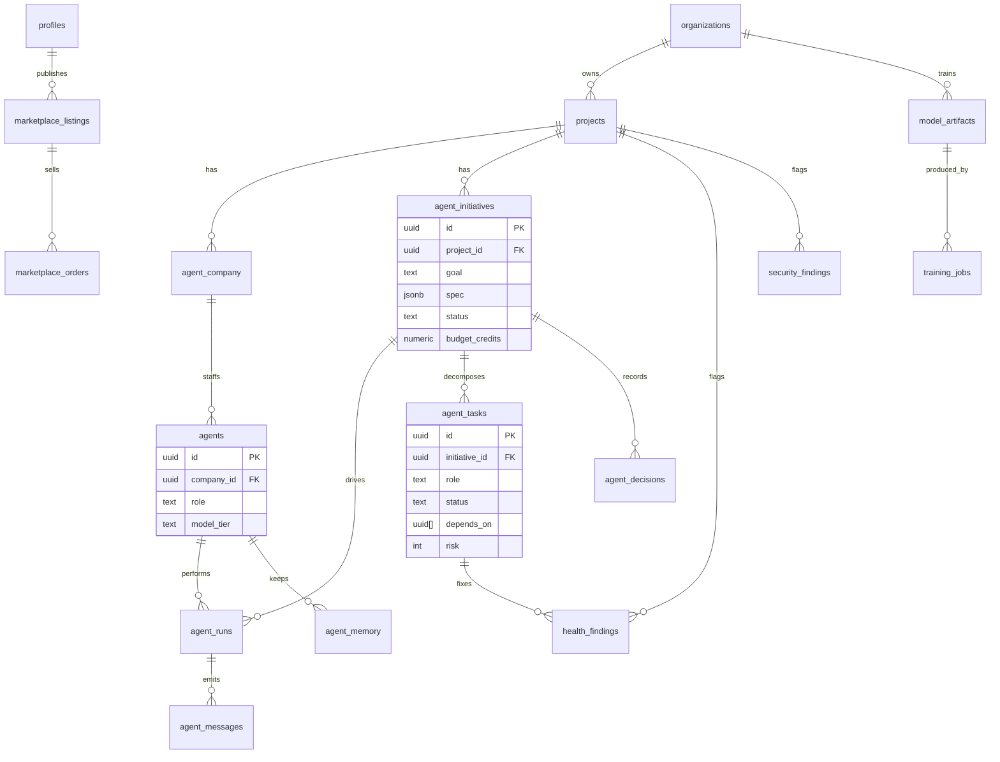

# 06 — Titan Database Schema

> New tables that back the Titan subsystems, layered on top of the existing
> schema (`profiles`, `projects`, `project_files`, `messages`, …). Runnable SQL:
> [`supabase/migrations/068_titan_ai_company.sql`](../../supabase/migrations/068_titan_ai_company.sql).
> Every table is **owner-scoped via RLS** exactly like `projects`.

## 1. ERD

## 2. Table reference

### Software-company core (docs 01–02)

| Table | Key columns | Purpose |
|-------|-------------|---------|
| `agent_company` | `project_id`, `status` | One virtual company per project |
| `agents` | `company_id`, `role`, `model_tier`, `system_prompt`, `config` | The 10 staffed roles |
| `agent_initiatives` | `project_id`, `goal`, `spec` (JSONB, doc 04), `status`, `budget_credits` | A user goal being executed |
| `agent_tasks` | `initiative_id`, `role`, `title`, `status`, `depends_on` (uuid[]), `risk`, `effort`, `result` | Task DAG nodes |
| `agent_runs` | `initiative_id`, `agent_id`, `task_id`, `status`, `tokens`, `ai_cents` | One execution of one agent |
| `agent_messages` | `initiative_id`, `from_role`, `to_role`, `channel`, `content` | Inter-agent comms (Realtime) |
| `agent_decisions` | `initiative_id`, `topic`, `decision`, `rationale`, `adr` | Recorded debates / ADRs |
| `agent_memory` | `agent_id` / `project_id`, `scope` (`role`\|`task`\|`shared`), `key`, `value` (JSONB) | Layered memory |

### Self-healing / security (doc 03)

| Table | Key columns | Purpose |
|-------|-------------|---------|
| `health_findings` | `project_id`, `kind` (`bug`\|`perf`\|`dead_code`\|`dependency`), `severity`, `file_path`, `status`, `fix_task_id` | Self-healing findings |
| `security_findings` | `project_id`, `category`, `cwe`, `cvss`, `severity`, `file_path`, `status` | Security scan results |

### Platform / business (doc 05)

| Table | Key columns | Purpose |
|-------|-------------|---------|
| `organizations` | `owner_id`, `name`, `brand` (JSONB), `custom_domain` | White-label tenants |
| `marketplace_listings` | `author_id`, `kind` (`agent`\|`workflow`\|`prompt_pack`\|`template`\|`plugin`\|`component`), `price_cents`, `status` | Marketplace + App Store catalog |
| `marketplace_orders` | `listing_id`, `buyer_id`, `amount_cents`, `commission_cents`, `status` | Sales + revenue share |
| `model_artifacts` | `org_id`, `base_model`, `provider`, `endpoint`, `status` | BYOM + fine-tuned models |
| `training_jobs` | `org_id`, `artifact_id`, `dataset_path`, `status`, `metrics` | Fine-tuning runs (off-request) |

## 3. Conventions (matching the existing repo)

- UUID PKs with `gen_random_uuid()`; `created_at`/`updated_at timestamptz default now()`.
- `status` columns are `text` with `CHECK` constraints (matches existing style).
- Foreign keys `on delete cascade` to the parent project/initiative.
- **RLS**: enabled on every table; policies authorize via the owning
  `projects.user_id` / `organizations.owner_id` (helper pattern reused from
  existing project-scoped tables). Service-role writes (agent runs, training jobs)
  use `createAdminClient()` and bypass RLS as today.
- Indexes on every FK + on `(initiative_id, status)` and `(project_id, status)`
  for the hot scheduler/observability queries.

## 4. Reused existing tables (no change)

`profiles` (credits/plan), `projects` (+ `cloud_*`, `environment`,
`cloud_tool_permissions`), `project_files`, `messages`, `deployments`,
`lifemark_cloud_usage`, `job_queue` (training + long runs), `feature_flags`,
`audit_logs`. Titan **adds** the `org_id` foreign key to `projects` (nullable —
null = personal project).

## 5. Type definitions

Add the new tables to `types/database.ts` under `public.Tables` following the
existing `Row`/`Insert`/`Update` shape. The orchestrator scaffold
(`lib/ai/titan/types.ts`) defines the application-level types that mirror these
rows.
