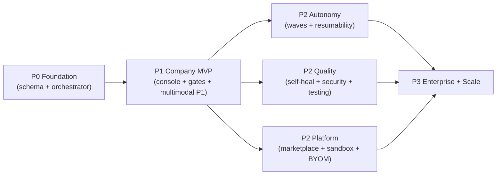

# 08 — Phased Roadmap

> How to build Titan v2.0 on top of LifemarkAI without a rewrite. Each phase is
> shippable on its own and de-risks the next. Effort is relative (T-shirt), not a
> calendar commitment.

## Phase 0 — Foundation (shipped in this change set)

Already in the repo:

- Design source of truth: `docs/titan/00–07`.
- Database: `supabase/migrations/068_titan_ai_company.sql` (15 tables + RLS + indexes).
- Orchestrator core: `lib/ai/titan/{types,roles,orchestrator}.ts` — 10 roles, the
  debate protocol, wave scheduler, CTO review — wired to existing `generateAI` +
  `MODEL_TIERS`.

Remaining to make P0 user-visible (small):

- `app/api/titan/initiative/route.ts` — wrap `runInitiative()` in the existing SSE
  pattern; persist via `createAdminClient()`.
- `app/api/titan/cto/route.ts` — wrap `ctoReview()`.
- Add the 15 tables to `types/database.ts`.

## Phase 1 — Software Company MVP  (M)

- Company Console UI (editor tab): live agent statuses, plan tree, debate threads
  (Realtime over `agent_messages`).
- Wire the QA step to the existing `lib/ai/self-verify.ts` loop.
- Autonomy gates (`database`/`deploy`/`spend`) reusing the `cloud_tool_permissions`
  JSON pattern; enforce `423` live-env lock on every Titan code-writing path.
- Multimodal P1: voice (`/api/ai/transcribe`), screenshot
  (`SCREENSHOT_TO_CODE_SYSTEM_PROMPT`), PDF (`pdf` skill) → Spec → build.

## Phase 2 — Autonomy + Quality + Platform basics  (L)

- Parallel task waves + resumability across the 300s `maxDuration` boundary
  (re-enter from first non-`done` wave, like `job_queue`).
- Self-Healing scheduled scans → `health_findings`; Security Center deps+code scans
  → `security_findings`; approval-gated auto-fix.
- Testing Lab: unit/integration/E2E generation + sandbox runs.
- Multimodal P2: Figma import + URL reverse-engineering (clean-room).
- Marketplace + AI App Store (catalog, Stripe Connect commissions, install).
- Sandbox (E2B first) + server-code live preview; BYOM key vault via the gateway.
- Observability Center as an auto-refreshing live artifact.

## Phase 3 — Enterprise + Scale  (XL)

- White-label tenancy (`organizations`, custom domains, per-org branding/models).
- AI Cloud Architect: multi-cloud IaC (Terraform/Helm/K8s) executed against
  user-connected cloud creds.
- Model Training Center: dataset upload + fine-tune jobs (`training_jobs`),
  fine-tuned models registered into the gateway.
- Video → app; mobile-screenshot reverse engineering.
- Global scale-out: read replicas, autoscaled Firecracker sandbox pool,
  multi-region, edge CDN — validated by the Testing Lab's load tests.

## Dependency graph (build order)

## What stays unchanged (leverage, don't rebuild)

Credits/billing (migrations 063–065), the AI gateway + usage logging, the
self-verify loop, the connector gateway, managed-backend provisioning, the
preview engines, Stripe/Resend/GitHub integrations, and the Supabase
client/RLS discipline. Titan is **additive**.

## Risks & mitigations

| Risk | Mitigation |
|------|------------|
| Multi-agent cost/latency blow-up | bounded debates, risk-gated debate convening, parallel-wave caps, per-initiative credit budget |
| Runaway autonomous loops | `MAX_WAVES`, per-task `maxIterations`, idempotent tasks |
| Live-data damage | `423` env lock on all code-writing paths; approval gates for db/deploy |
| Reverse-engineering IP concerns | clean-room provenance; behavior-only reconstruction; no source/asset copying |
| Scope (100M users) | treated as target architecture, sequenced last, gated on load testing |
